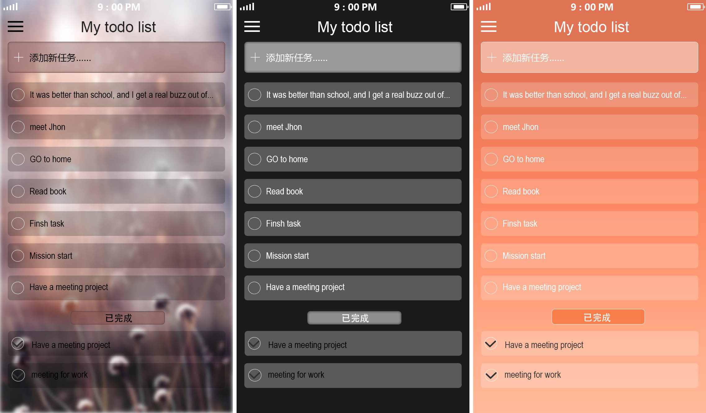

# TodoList Redux

使用 Redux 管理数据流，实现一个 TodoList 应用。

[在线 DEMO](https://zfanli.github.io/blueprint/demo/todolist-redux/demo/)

[源代码](https://github.com/zfanli/practice/tree/master/react/src/todos-redux)

UI 设计效果：

数据流向：

